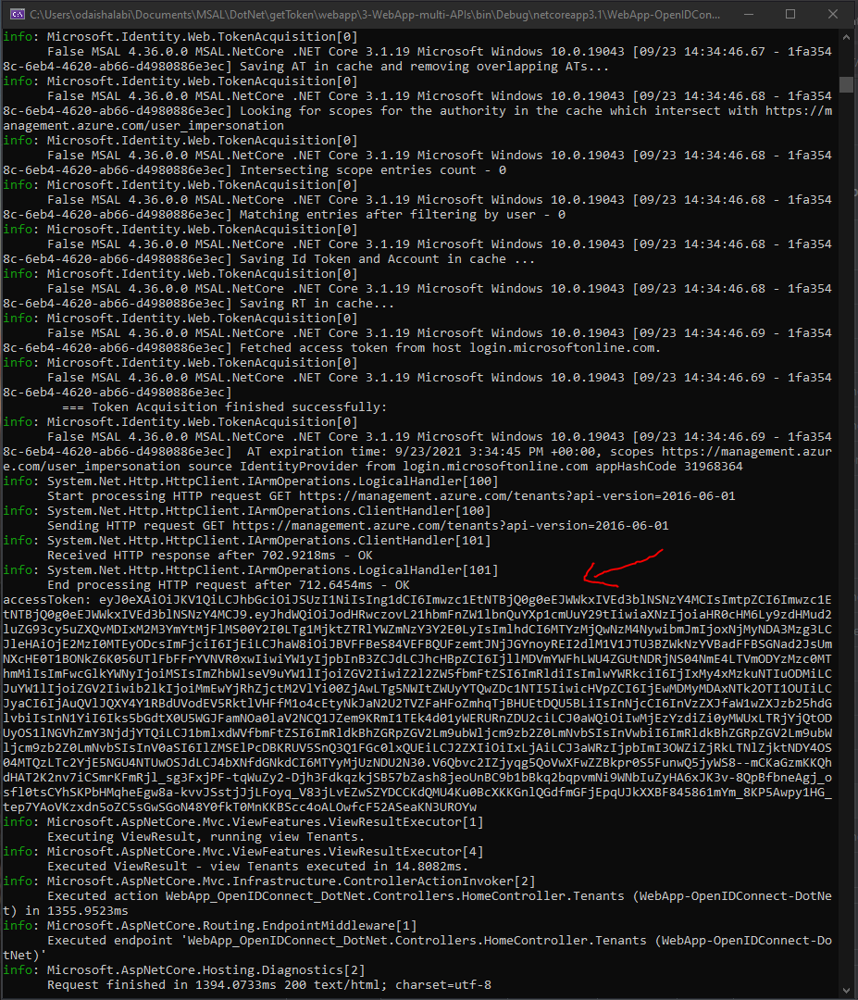

# Override `redirectURI` in Microsoft Identity Web

>:warning: Please refer to this [GitHub issue link](https://github.com/AzureAD/microsoft-identity-web/issues/115) for more info on this [feature](https://github.com/AzureAD/microsoft-identity-web/issues/115#issuecomment-618984571).

## Update the target framework (Optional!)

This sample was created on dotnet core 3.1, to update the target framework to use `net5.0` intead, please do the following or refer back to this [doc](https://docs.microsoft.com/en-us/aspnet/core/migration/31-to-50?view=aspnetcore-5.0&tabs=visual-studio#update-the-target-framework):

- Update `YOUR_PROJECT.csproj` under `<Project Sdk="Microsoft.NET.Sdk.Web">`:

  ```diff
  <Project Sdk="Microsoft.NET.Sdk.Web">

      <PropertyGroup>
  -    <TargetFramework>netcoreapp3.1</  TargetFramework>
  +    <TargetFramework>net5.0</  TargetFramework>
      </PropertyGroup>

  </Project>
  ```

  

- Delete `bin` and `obj` folders

  You may need to delete the `bin` and `obj` folders. Run `dotnet nuget locals --clear all` to clear the NuGet package cache

## How to run this sample

Please refer back to the official Microsoft [azure-samples](https://github.com/Azure-Samples/active-directory-aspnetcore-webapp-openidconnect-v2/tree/master/3-WebApp-multi-APIs) page to learn more.

## About the code

- Added the API to my registered app
    

- From `Startup.cs` we will update the configure to implement `OpenIdConnectOptions`:
    ```csharp
    services.AddAuthentication(OpenIdConnectDefaults.AuthenticationScheme)
                .AddMicrosoftIdentityWebApp(Configuration)
                .EnableTokenAcquisitionToCallDownstreamApi()
                .AddInMemoryTokenCaches();

            services.Configure<OpenIdConnectOptions>(OpenIdConnectDefaults.AuthenticationScheme,
            options =>
            {
                var redirectToIdpHandler = options.Events.OnRedirectToIdentityProvider;
                options.Events.OnRedirectToIdentityProvider = async context =>
                {
                    // Call what Microsoft.Identity.Web is doing
                    await redirectToIdpHandler(context);

                    // Override the redirect URI to be what you want https://localhost:44321/signin-oidc
                    if (Configuration["AzureAd:WebAppURI"] != null)
                    {
                        context.ProtocolMessage.RedirectUri = Configuration["AzureAd:WebAppURI"] + Configuration["AzureAd:CallbackPath"];
                        System.Console.WriteLine("RedirectURL: " + Configuration["AzureAd:WebAppURI"] + Configuration["AzureAd:CallbackPath"]);
                    }
                };

                var redirectToIdpForSignOutHandler = options.Events.OnRedirectToIdentityProviderForSignOut;
                options.Events.OnRedirectToIdentityProviderForSignOut = async context =>
                {
                    // Call what Microsoft.Identity.Web is doing
                    await redirectToIdpForSignOutHandler(context);

                    // Override the redirect URI to be what you want
                    if (Configuration["AzureAd:WebAppURI"] != null)
                    {
                        context.ProtocolMessage.PostLogoutRedirectUri = Configuration["AzureAd:WebAppURI"] + Configuration["AzureAd:SignedOutCallbackPath"];
                        System.Console.WriteLine("PostLogoutRedirectURL: " + Configuration["AzureAd:WebAppURI"] + Configuration["AzureAd:SignedOutCallbackPath"]);
                    }
                };
            });
    ```

- Update the `appsettings.json` and add the following parameter
    ```diff
    "AzureAd": {
    "Instance": "https://login.microsoftonline.com/",
    "Domain": "addidev.onmicrosoft.com",
    "TenantId": "YOUR_TENANTID",
    "ClientId": "YOUR_APPID",
    "CallbackPath": "/signin-oidc",
    "SignedOutCallbackPath": "/signout-callback-oidc",
    + "WebAppURI": "https://localhost:44321",

    // To call an API
    "ClientSecret": "YOUR_SECRET"

    },
    ```

- The expected output from running the code:
    
    
    Generate accessToken to call azure service management API
    
    

    Let's decode the accessToken
    